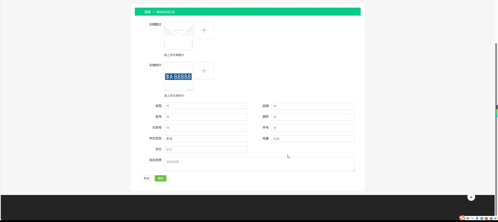
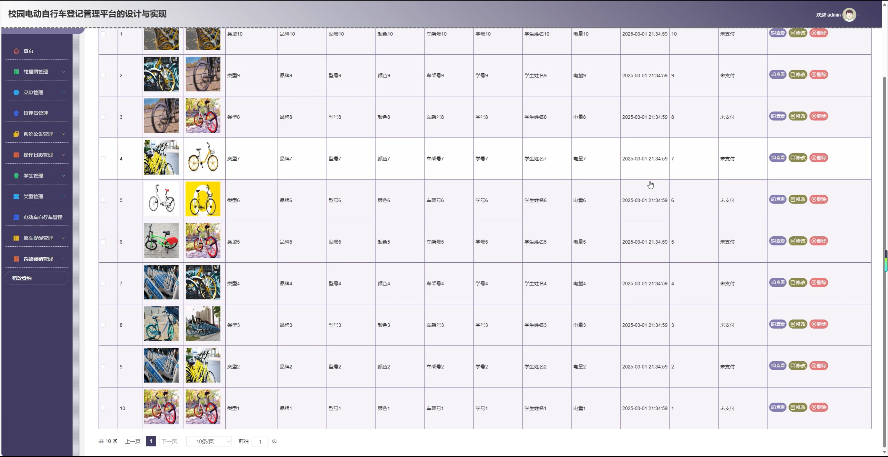
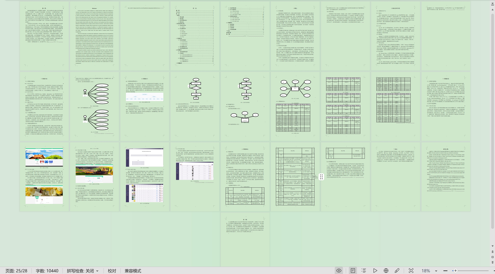

# springbootA518D
springbootA518D校园电动自行车登记管理系统+LW+PPT
## 查看主页获取源码

### 一、关键词
电动车自行车管理、挪车提醒管理、罚款缴纳管理

### 二、作品包含
源码+数据库+设计文档万字+ppt+全套环境和工具资源+本地部署教程

### 三、项目技术
前端技术：Html、Css、Js、Vue3.0、Element-plus
后端技术：Java、SpringBoot3.0、MyBatis

### 四、运行环境（以下版本亲测，其他版本未知，请自测）

开发工具：IDEA/eclipse  + VSCODE

数据库：MySQL5.7（最低要5.7版本）

数据库管理工具：Navicat10以上版本

环境配置软件： jdk17 + Maven3.6.3

前端Nodejs：20

浏览器：谷歌浏览器

### 五、项目介绍
项目编号：springbootA518D

校园电动自行车登记管理系统能规范校园内电动自行车的信息备案、通行及安全管理，维护校园交通秩序与安全。

角色：管理员、用户

管理员：首页、轮播图管理、菜单管理、管理员管理、系统公告管理、操作日志管理、学生管理、类型管理、电动车自行车管理、挪车提醒管理、罚款缴纳管理。

用户：首页、系统公告、个人中心、修改密码、电动车自行车、挪车提醒、罚款缴纳。

### 六、运行截图

